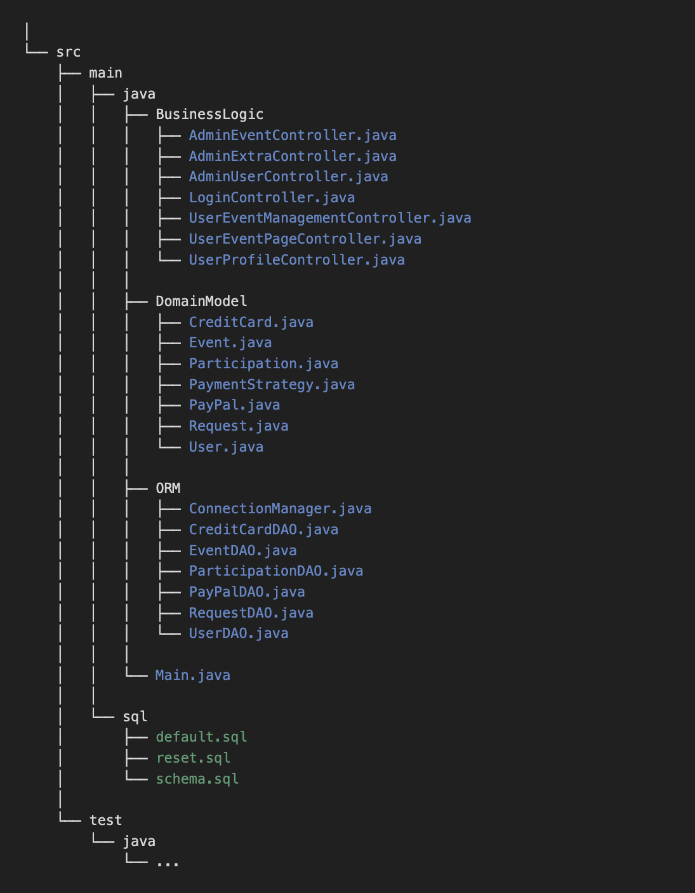

# RendezVous

### Descrizione del progetto

L'intento del progetto è quello di sviluppare un programma che permette la creazione di eventi e la partecipazione agli stessi. 
Comprende un sistema di più utenti che creano eventi e partecipano agli eventi creati da altri. 
È implementato anche un utente admin che può gestire tutti gli utenti e tutti gli eventi. 
Inoltre è stato connesso anche un database in cui vengono salvati tutti i dati degli utenti e degli eventi.

### Classi Domain Model

- **User:** rappresenta un utente.
- **Event:** rappresenta un evento creato da un utente.
- **Participation:** rappresenta una partecipazione di un utente a un particolare evento.
- **Request:** rappresenta una richiesta che un user può fare all'admin per modificare un evento che ha creato.
- **PaymentStrategy** *⟨⟨interfaccia⟩⟩***:** interfaccia che rappresenta la strategia di pagamento.
- **CreditCard:** una delle strategie di pagamento.
- **PayPal:** una delle strategie di pagamento.

### Funzionalità principali

- *Creare un evento*: un utente può creare un evento visibile agli altri utenti.
- *Partecipare a un evento*: un utente può visualizzare gli eventi creati e partecipare a un evento pagando la quota prevista.
- *Modificare un evento*: lʼ utente che ha creato un evento può modificare la descrizione e/o fare richiesta all' admin per modificare gli altri attributi.

### Struttura del progetto

